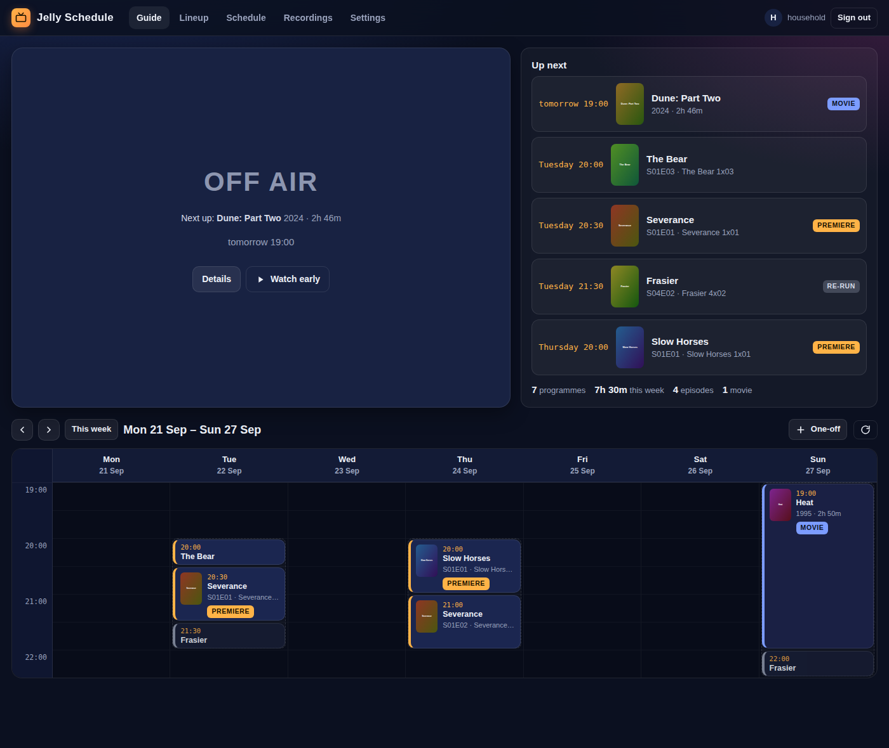
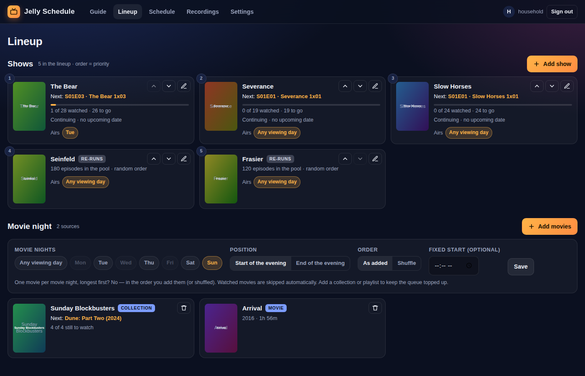
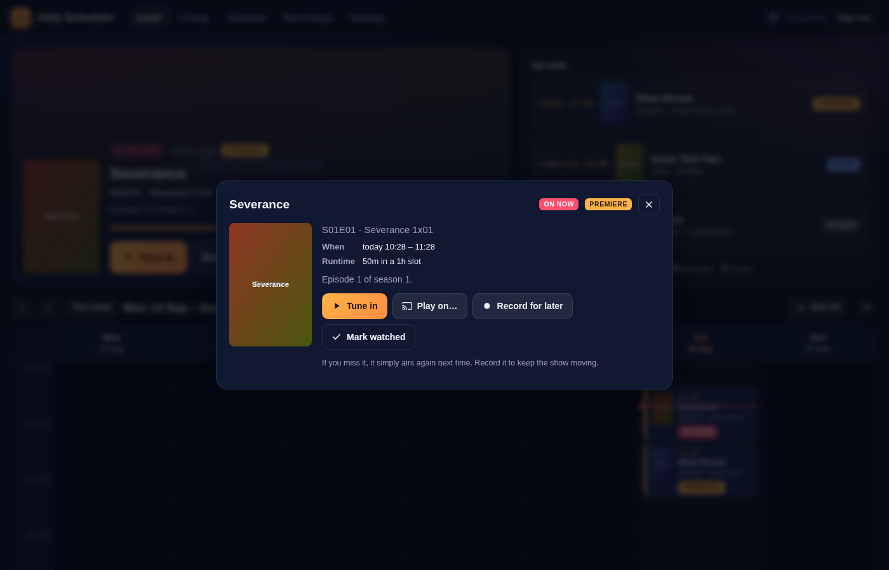
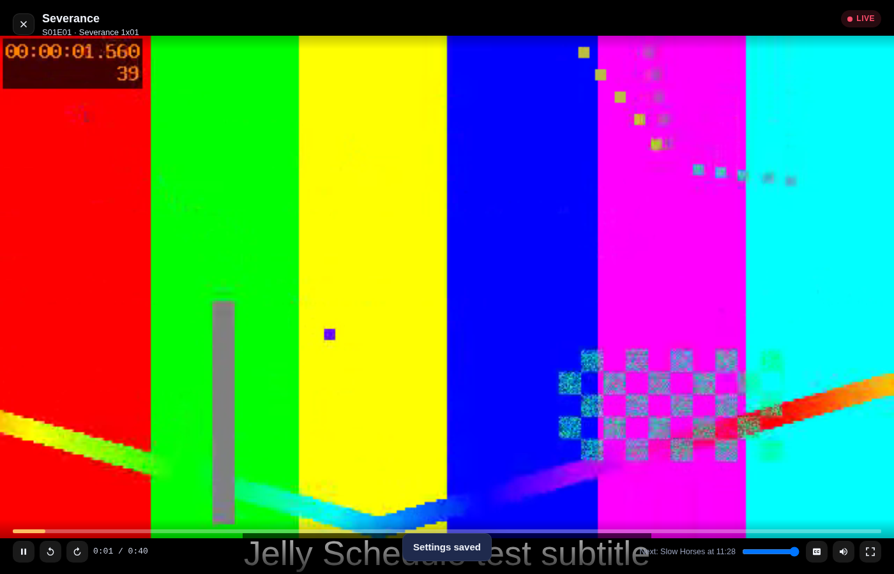

# Jelly Schedule

**Your Jellyfin library as a weekly TV channel.**

Remember when the TV guide decided what was on? Sunday-night blockbusters, a new episode of your show every Tuesday at 8, a sitcom re-run to wind down — and *nothing* when the channel went off air. Jelly Schedule brings that back for your own library, so you watch the things you love, on the evenings you actually have time, without the binge-and-burnout cycle.

<p align="center"></p>

## What it does

1. **Choose when you watch** – pick the days of the week and the hours (e.g. Tue + Thu 20:00–22:00, Sun 19:00–22:30). Everything is cut into 30-minute slots like a printed TV listing. Outside those hours the channel is *off air*.
2. **Build your lineup** – add the series you are following. Each one gets **one new episode per airing, in order**, skipping anything already watched (it uses Jellyfin's watched status). Pin a show to particular days ("The Bear is on Tuesdays") or let it rotate through free evenings.
3. **Movie night** – pick the day(s) movies air on. Add single movies, a collection or a playlist; the next unwatched one is scheduled automatically.
4. **Re-runs** – mark comfort shows (sitcoms with a hundred episodes) as *re-runs*. Random episodes fill leftover time; watched status is ignored.
5. **The guide** – open Jelly Schedule and you get a week-at-a-glance TV guide, an **On now** panel with a big *Tune in* button, and *Up next*. When something is on, it offers to start playing right away.
6. **Record** – can't make tonight's slot? Hit *Record*. The episode goes to your **Recordings** to watch whenever, and the show carries on from the next episode. If you simply miss a slot without recording, the episode airs again next time — nothing is lost.
7. **Airing dates** – for shows still on the air, the lineup shows when the next episode is broadcast, from **Sonarr** (if you have it) or **TVmaze** (free, no API key). Radarr can show the movies you are still waiting for.

Extras: a built-in player with subtitles and audio selection (direct play, with transcoding fallback), *play on another device* (your TV app, phone…), **Relaxed** vs **Strict** live mode (start from the beginning vs join in progress like real TV), an *Up next* countdown between programmes, an *Off air* screen when the evening is over, one-off programmes ("Friday: Dune"), away dates (holidays), season/series finale badges, and an **iCal feed** so the schedule shows up in your phone's calendar.

## Screenshots

| Guide | Lineup |
| --- | --- |
|  |  |

| Programme details | Player |
| --- | --- |
|  |  |

## Installation

Requires Jellyfin **10.11** or **12.x** (both are built from the same source).

1. In Jellyfin: *Dashboard → Plugins → Repositories → +* and add
   `https://raw.githubusercontent.com/acdewinter/jelly_schedule_plugin/main/manifest.json`
2. *Catalog → Jelly Schedule → Install*, then restart Jellyfin.
3. Open **`http://<your-jellyfin>/JellySchedule/app`** (also linked from *Dashboard → Plugins → Jelly Schedule*). Every Jellyfin user can sign in; bookmark it on the TV's browser and on your phones.

Manual install: download the zip for your Jellyfin version from the [releases page](https://github.com/acdewinter/jelly_schedule_plugin/releases), unzip it into `<jellyfin config>/plugins/JellySchedule/` and restart.

### Optional: Sonarr / Radarr

*Dashboard → Plugins → Jelly Schedule* → enter the URL and API key (Sonarr → *Settings → General → API Key*) and press *Test*. Without Sonarr, air dates come from TVmaze automatically.

## How the schedule works

- **Household user.** The schedule follows one Jellyfin user's watched history (chosen by an admin in *Settings*; defaults to the first admin). Sign in as that user on the TV — or sign in as anyone else and Jelly Schedule will mirror what you watch to the household user, so the schedule still moves on.
- **Slots.** Runtimes are rounded up to whole slots: a 22-minute sitcom takes 30 minutes, a 45-minute drama an hour, a 2h46 movie three hours. A movie may run past the end of the window (it is marked *Runs late*).
- **Order of play each evening:** one-offs → the movie (on movie nights) → pinned shows in lineup order → floating shows (the one that aired least recently first) → re-runs to fill what is left (or nothing / extra episodes, see *Settings → Leftover time*).
- **Stability.** Once a programme has started it is *frozen* in the guide, so the history stays put even if you edit the lineup. Future days are recomputed on every view from the current watched state, so nothing goes stale. A background task ("broadcast tick") keeps the history accurate even when nobody has the app open.
- **Missed vs recorded.** An episode that aired but was not watched is marked *Missed* and simply airs again in that show's next slot. *Record* moves it to Recordings and lets the show advance.
- **Deterministic re-runs.** Re-run picks are seeded from the date and slot, so the guide does not shuffle every time you look at it.

## Development

```
dotnet build Jellyfin.Plugin.JellySchedule/Jellyfin.Plugin.JellySchedule.csproj -c Release   # builds net9.0 (10.11) and net10.0 (12.x)
dotnet test tests/Jellyfin.Plugin.JellySchedule.Tests                                       # scheduling engine tests
./scripts/package.sh                                                                        # zips in dist/
```

`tools/DevHost` runs the real plugin API and web app against an in-memory fake library with mock Jellyfin endpoints — handy for working on the UI without a Jellyfin server:

```
cd tools/DevHost && JS_SAMPLE_VIDEO=/path/to/any.mp4 dotnet run     # then open http://localhost:5000/JellySchedule/app, user "household"
NODE_PATH=$(npm root -g) node tools/ui-test/ui-test.mjs http://localhost:5000 ./screenshots   # Playwright smoke test
```

The web app is plain HTML/CSS/JS (`Jellyfin.Plugin.JellySchedule/Web`), embedded in the plugin and served at `/JellySchedule/app`. Schedule data is stored in `<config>/plugins/configurations/JellySchedule/schedule.json`. [hls.js](https://github.com/video-dev/hls.js) (Apache-2.0) is bundled for transcoded playback.

### API and other clients

All endpoints live under `/JellySchedule/` and use normal Jellyfin authentication. The full contract (endpoints, JSON shapes, tune-in and auto-advance rules) is in [docs/API.md](docs/API.md), so other clients can be built on it. A brief for a native Android TV companion app is in [docs/COMPANION_APP_BRIEF.md](docs/COMPANION_APP_BRIEF.md).

## License

MIT — see [LICENSE](LICENSE).
